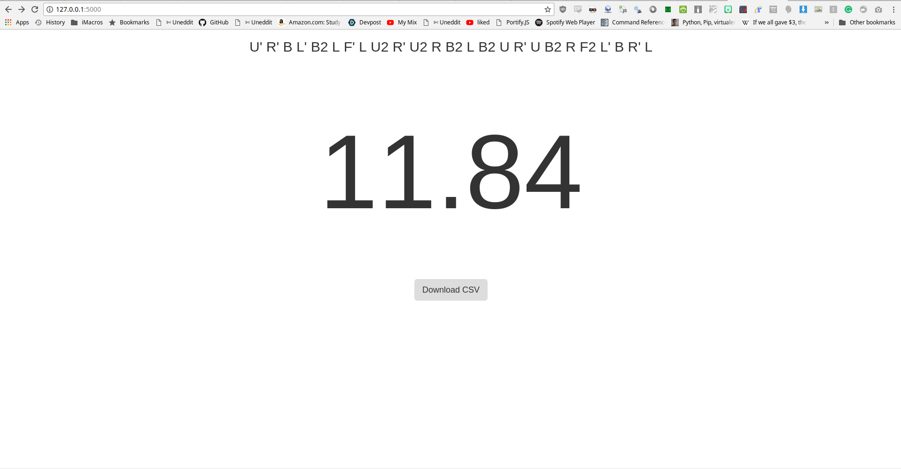

# Cubuyo
Minimalistic Rubik's cube timer with CSV session summaries

<h1 align="center"><a href="https://cubuyo.herokuapp.com/">Link to the Web App</a></h1>

### Running Locally on Windows/Linux/OSX

You'll need to first install Python and [add it to your system path](https://pythongisandstuff.wordpress.com/2013/07/10/locating-python-adding-to-path-and-accessing-arcpy/)

Clone or download this Repo by either running

```
git clone hhttps://github.com/theriley106/Cubuyo
```
or by downloading it from Github directroy.  I **HIGHLY** recommend downloading it using the Git command, as it allows you to update the repository with a single line of code.

Afterwards, try to run:

```
pip freeze
```
And if an error is returned you will need to install python-pip on your system by downloading [get-pip.py](https://bootstrap.pypa.io/get-pip.py) and running

```
cd $DOWNLOADFOLDERPATH
python get-pip.py
```

You can exit out of this terminal, and open up a new terminal inside of the Cubuyo directory.

After this, you'll need to install all of the python modules this package depends on.  You can either do it manually or you can run

```
pip install -r requirements.txt
```

After all the requirements are installed, you'll need to start up the flask app by running

```
python app.py
```

Afterwards, open up a web browser and go to http://0.0.0.0:8000

You can also access this site on any computer that is connected to your network by accessing http://YOURIPADDRESS:8000 from another computer.

You can find your local IP address by running

```
ipconfig
```

## Web App

<p align="center">
  
</p>
